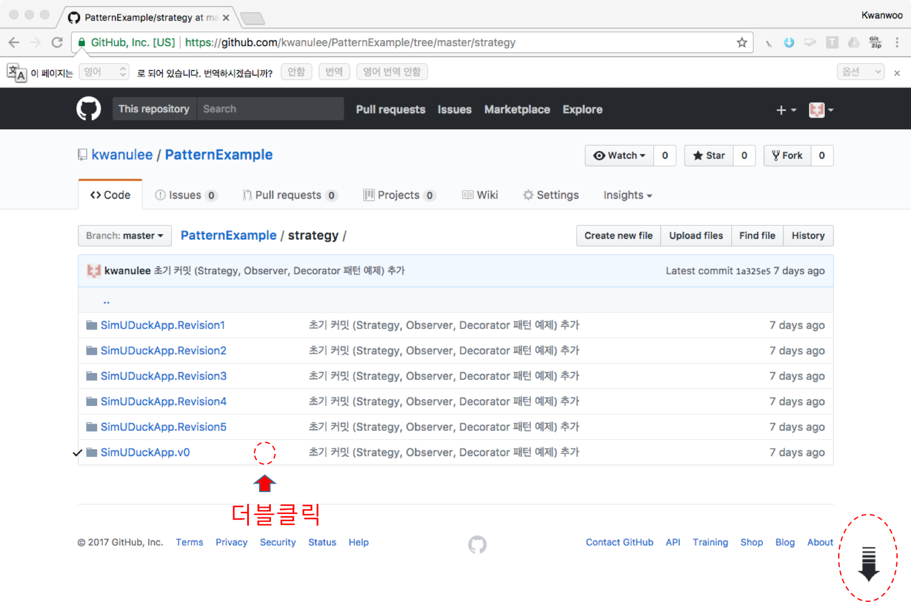
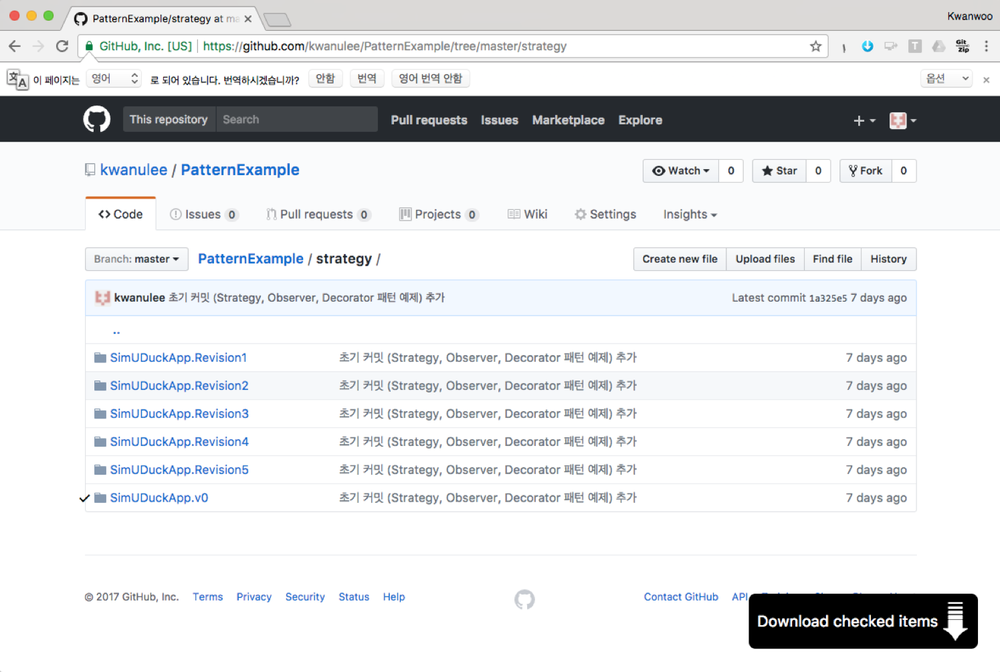

#Design Patterns Code Examples

이 저장소에 나온 Code는 [Head First Design Patterns](http://shop.oreilly.com/product/9780596007126.do) 책의 예제를 [IntelliJ IDEA IDE](https://www.jetbrains.com/idea/) 프로젝트 형식으로 만든 것입니다.

각 패턴의 예제 프로젝트를 개별적으로 다운 받기 위해서는 다음 방법을 사용하면 편리합니다.

1. **Chrome 브라우저**에서 [GitZip for github](https://chrome.google.com/webstore/detail/gitzip-for-github/ffabmkklhbepgcgfonabamgnfafbdlkn) 사이트를 접속하여 **[CHROME에 추가]** 버튼을 클릭하여 **GitZip for github** 확장 프로그램을 **Chrome**에 추가합니다.

2. 다운 받고자 하는 **GitHub 저장소의 특정 디렉토리**의 빈 공간을 더블 클릭한다.

	가령, **strategy 패턴의 SimUDuckApp.v0** 프로젝트를 다운 받으려면, 아래 그림처럼 SimUDuckApp.V0 폴더 행의 빈공간을 클릭하면 오른쪽 아래에 아래 방향의 화살표가 생성됩니다.

	 

3. 화면 오른쪽 아래의 **아래 방향의 화살표**로 마우스 포인터를 이동하면 **Download Checked Item** 이 나타나고 이를 클릭하여 다운로드

	 